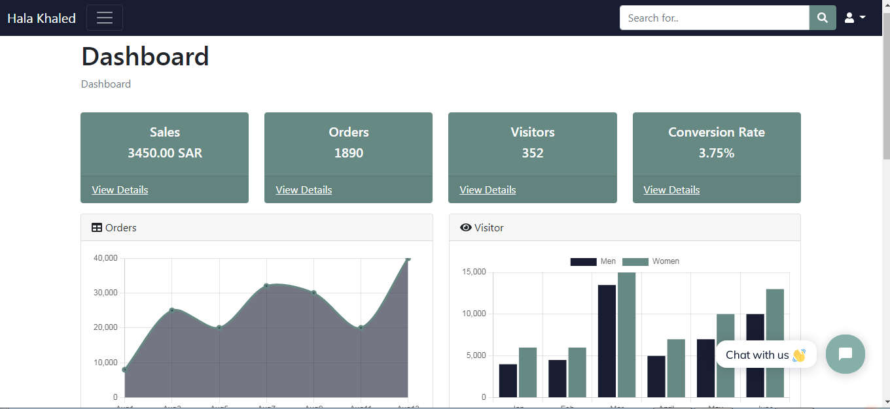
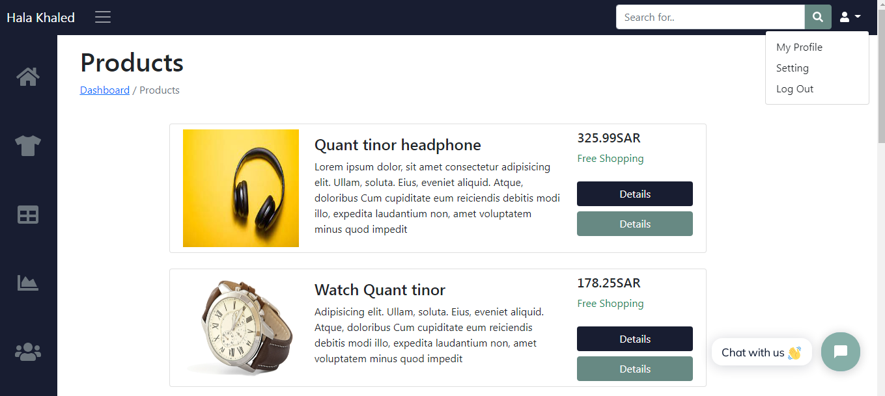

#  Dashboard

## Introduction
Simple responsive front-end dashboard. This dashboard uses the Bootstrap styles along with a variety of powerful libraries and tools to create a powerful admin panel.

### Technologies Used:
* HTML
* CSS
* JavaScript
* [Fontawesome](https://fontawesome.com/ "Fontawesome")
* [Bootstrap](https://getbootstrap.com/ "Bootstrap")
* [ Chartjs](https://www.chartjs.org/ " Chartjs")
* [ Datatables](https://datatables.net/ " Chartjs")
* [Tidio](https://www.tidio.com/ "Tidio")

## Project Prototype
- Home Page

- Products Page

## Project Functions
- Design Responsive Dashboard by Bootstrap
- Use Fontawesome library to add icons.
- Use Chart JavaScript library to design the Reports'chart
- Use map() Js for mapping products array list int card that displays on the Products page.
- Use Tidio integrations to add chatbot in dashboard website.

### The Dashboard  Demo
You can visit Dashboard website [link here](https://inspiring-morse-928806.netlify.app/)

